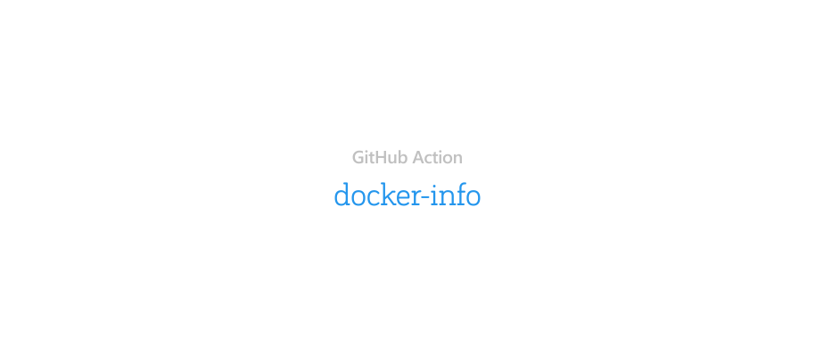

<p align="center"><a href="#readme"></a></p>

<br/>

Action for printing info about Docker image.

### Usage

Add next code to your workflow file:

```yml
  DockerBuild:
    name: Build Image
    runs-on: ubuntu-latest

    steps:
      - name: Code checkout
        uses: actions/checkout@v4

      - name: Login to DockerHub
        uses: docker/login-action@v1
        env:
          DOCKERHUB_USERNAME: ${{ secrets.DOCKERHUB_USERNAME }}
        if: ${{ env.DOCKERHUB_USERNAME != '' }}
        with:
          username: ${{ secrets.DOCKERHUB_USERNAME }}
          password: ${{ secrets.DOCKERHUB_TOKEN }}

      - name: Build Docker image
        run: |
          docker build -f Dockerfile -t myimage .

      - name: Show info about built Docker image
        uses: essentialkaos/docker-info-action@v1
        with:
          image: myimage
          show-labels: true

```

### Options

| Option | Description | Value |
|--------|-------------|--------|
| `image` | One or more Docker images | _String_ |
| `labels` | Show image labels | _Boolean_ |

### License

[Apache License, Version 2.0](https://www.apache.org/licenses/LICENSE-2.0)

<p align="center"><a href="https://essentialkaos.com"></a></p>
